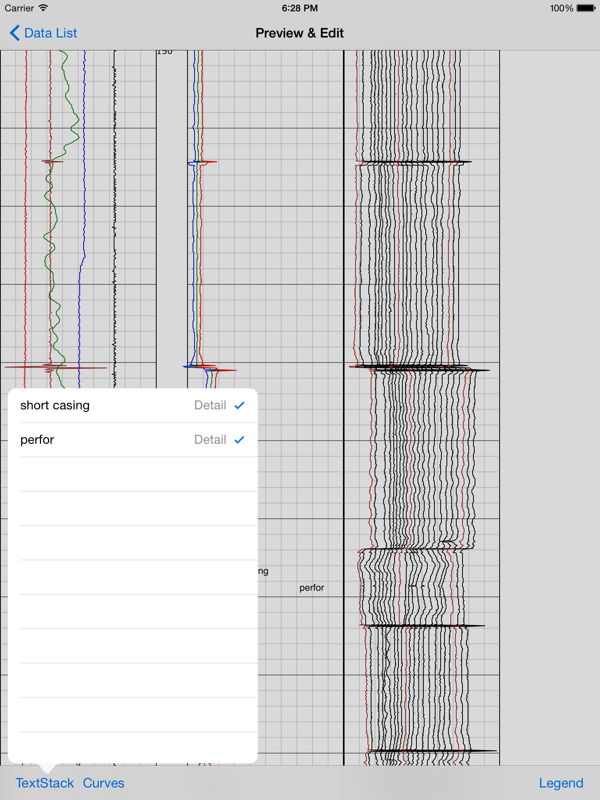

LoggingPad
==========

石油测井数据的分析查看、添加注释、选择曲线。

流程:

* 用户导入LAS等数据文件，使用iTunes
* 在列表视图中选择此数据，转换生成svg图像文件.已经存在svg文件则不转换
* 显示svg对应的测井曲线图形
* 点击曲线则高亮选中曲线
* 选择矩形区域可添加关于解释结论的注释
* 点击底部工具栏的TextStacks按钮，可以查看已经添加过的注释。删除注释可以点击此注释
* 点击Curves按钮，显示所有的曲线名称列表，高亮曲线可以点击曲线名称
* 点击Legend按钮，显示此数据的图利供参考

依赖库:

* SVGKit
* GRMustache
* FCFileManager
* YOLOKit